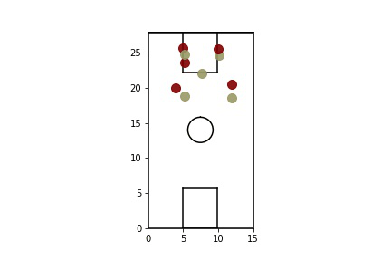
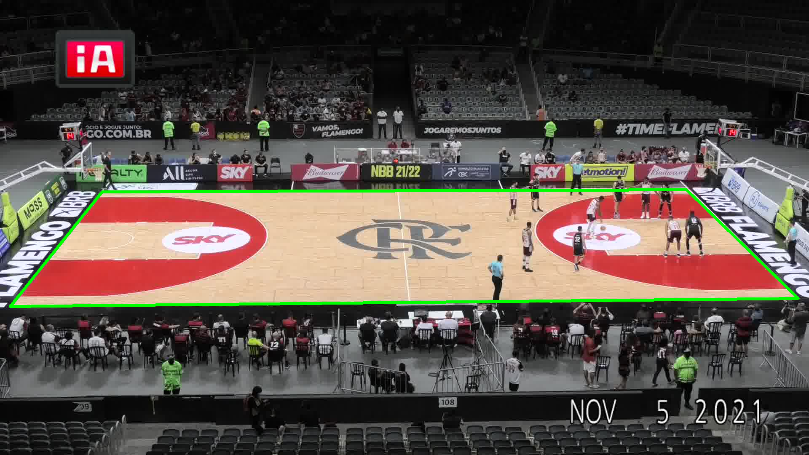
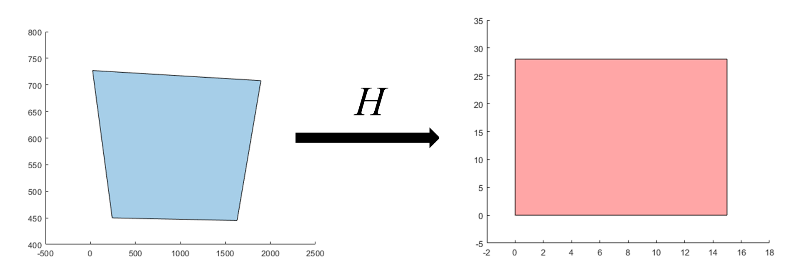
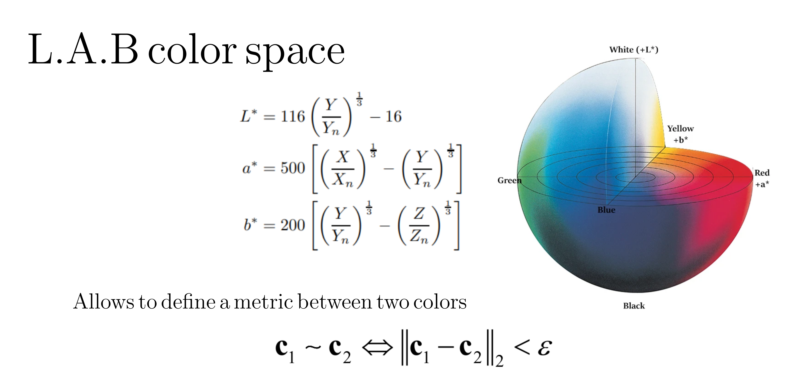
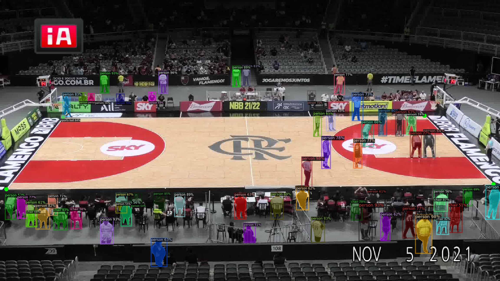
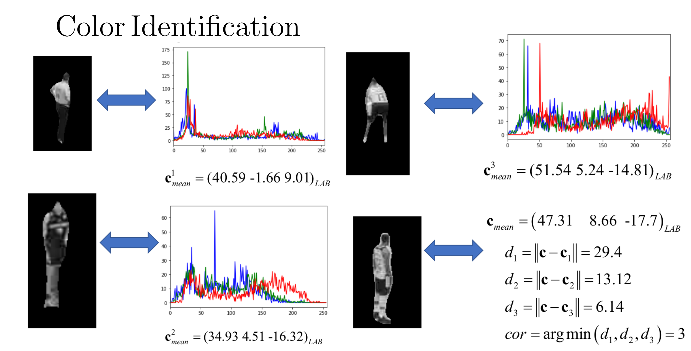
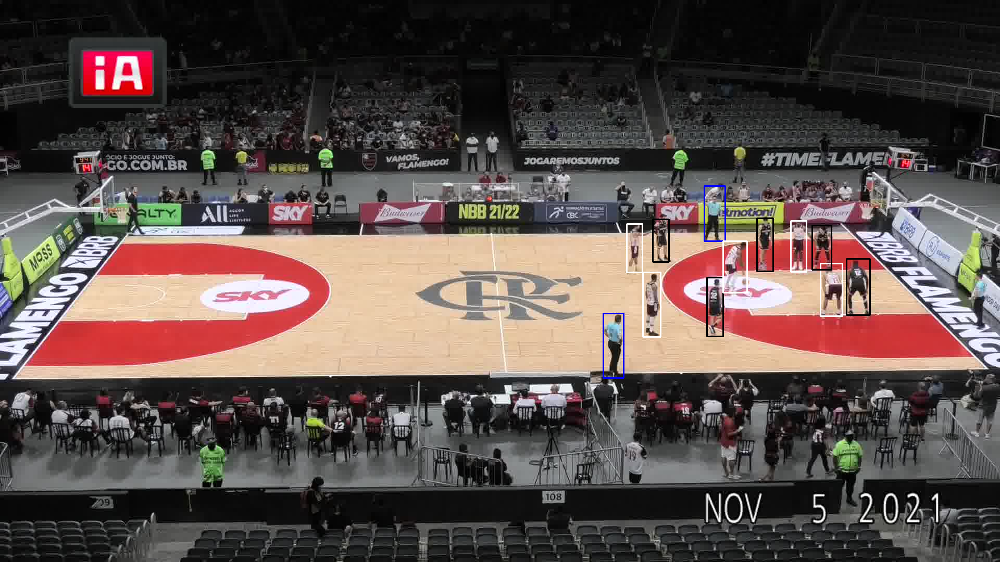

# SimpleTracker

This project is a simple implementation of a tracker of a basketball match. It was presented as a final project for
the class "Fundamentos da Computação Gráfica", see [here](https://web.tecgraf.puc-rio.br/~mgattass/fcg/fcg.html) for more information.

# 1) Requiremnts

The backbone of the project were two neural networks: detectron2 and yolov5


# 2) Rationale 

We have as input a recorded match [video](data/short.mp4) from a static camera. From this, 
we proposed the followig algorithm for tracking the basketball players:
- 1) Find the homography transformation that relates the real basketball court with the one projected in the camera space
- 2) Define a color mapping for the players using a Semantic Segmentation Neural Network (SSNN) - detectron2
- 3) For a real-time performance changed the SSNN to a object detection neural network (YoloV5)
- 4) Implement a simple Kalman Filter model to estimate the bounding box motion across two consecutive frames
- 5) Project the bottom center of the estimated bounding box into the court using the homography defined in step 1)

The final result was the following:



## 2.1) Homography Transformation

Here we implemented a simple algorithm that finds the transformation between two quadrilaterals (`quad2H` in [[homography.m]]) . One compreends the boundary of the court while the other was obained by taking manually the pixels of the boundary of the projected court:

The obtained homography was the following:

```text
H = [ 0.0003  0.0762 -34.3988 ]
    [ 0.0203  0.0160 -12.1036 ]
    [ 0.0000  0.0013   0.4440 ]
```


## 2.2) Player color identification

First we recall the concept of CIELAB color space, where the color is transformed into a space where the notion 
of distance with the Euclidan norm can be obtained:


Then, we first ran the SSNN over the first image obtaining the following result:


From this first inference, we extracted a base set for each player and transformed its mean color to the LAB space. Then, at each run-time inference, we used a simpler neural network with object detection, and compared the euclidean norm with each color basis. We attributed the player color by taking the smallest distance to the basis. This is explained in the following picture:


Finally, this is the final result in run-time:


## 2.3 Kalman Filter model

In real-time we used the YoloV5 NN to obtain the bounding box of each player. After identifing its color with step 2.2) we tracked its bounding box bottom center using a Kalman Filter model in the 2D picture space. For the prediction step we assumed that the bounding box is moving with a constant velocity, while in the update step, we we used as innovationt the difference between the center of the current inference compared with the center of the current prediction. This is same rationale was used in the [SORT](https://arxiv.org/pdf/1602.00763) paper.